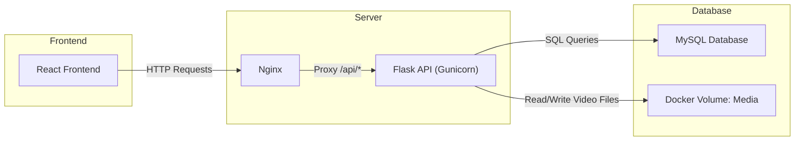

# Video Streamer


## Overview
The Video Streamer project provides a Dockerized full-stack solution for managing, storing, and streaming video content. The backend is a Flask RESTful API with a MySQL database for storing video metadata, while the frontend is a React single-page application served via Nginx.

Videos are stored in a Docker volume called `Media` and are streamed using HLS (HTTP Live Streaming). Only `.mp4` files are supported for conversion to HLS, and all files follow a SHA256 hash naming convention to avoid conflicts.

The architecture is designed for scalability, easy deployment, and maintainability, with multi-worker Gunicorn handling the backend and proper logging for debugging and monitoring.
## Key features
- Dockerized Architecture: Easily run backend, frontend, and database with Docker Compose.
- RESTful Backend API: Flask API for managing media metadata and streaming endpoints.
- HLS Video Streaming: Converts .mp4 files to HLS format for adaptive streaming.
- Persistent Media Storage: Videos stored in a Docker volume (Media) for durability.
- SHA256 Hash Filenames: Avoids file conflicts and ensures consistent naming.
- React Frontend: Single-page application for browsing, uploading, and streaming videos.
- Nginx Server: Serves frontend and proxies /api/* requests to backend.
- Multi-Worker Gunicorn: Handles concurrent backend requests safely.
- Logging & Monitoring: Centralized logging for backend processes, database actions, and HTTP requests.
- Database Initialization Safety: Multi-worker safe table creation to prevent race conditions.


## Tech Stack


| Layer      | Technology/Framework      | Description  | 
| -----------| ------------------------- |------------- |
| Frontend | React |Single-page application for video browsing and streaming.|
| Frontend | Server Nginx |Serves the compiled React app and proxies API .|
| Backend API| Flask	RESTful |API for managing media metadata and handling video streaming requests.|
| Backend Server| Gunicorn |WSGI server running Flask app, supporting multiple workers for concurrency.|
| Database| MySQL |Stores video metadata and other persistent data.|
| Media Storage| Docker Volume |Persistent volume Media stores all video files.|
| Containerization| Docker / Docker Compose |Orchestrates backend, frontend, database, and volumes.|
| Video Streaming Format| HLS (.mp4 input) |Converts .mp4 files to HTTP Live Streaming (HLS) format for streaming.|
| Logging & Monitoring| Python logging + Gunicorn |Logs application events and errors to console and file for debugging and monitoring.|

## Architecture

**Explanation:**  
- React Frontend: SPA served by Nginx, sends API requests to /api/*.
- Nginx: Serves static React files and proxies backend API requests.
- Flask API (Gunicorn): Handles media metadata and streaming logic.
- MySQL Database: Stores all video metadata.
- Docker Volume Media: Stores actual video files (.mp4) and HLS segments for streaming.


## Prerequisites
- Docker >= 20.10
- Docker Compose >= 2.0
- Python 3.10+ (for local backend development)
- WSL or linux


## Installation & Setup

1. Clone repository
```
git clone <REPO_URL>
git submodule update --init --recursive
```
2. Setup secret
```
echo "your_root_password" > db_root_password.txt
```
3. Create Docker networks and volumes:
```
docker network create backend
docker volume create Media
```

 ## Running the Project

**Build and start all services:**  
```
docker-compose up --build -d
```
**Recreate containers if needed:**
```
docker-compose up --build --force-recreate -d
```


**Access endpoints:**  (replace *localhost* with actual host)

- API: http://localhost:8080/api
- SwaggerUI:  http://localhost:8080/api/doc
- Frontend: http://localhost:8080


## Frontend & Backend

- Frontend (React): served by Nginx, static build files, caching, compression
- Backend (Flask): Gunicorn multi-worker server, RESTful API for media management


## Database & Media Storage
- MySQL database stores video metadata
- Docker volume Media stores .mp4 videos converted to HLS
- Table creation is multi-worker safe
- Database secrets are loaded via Docker volume: